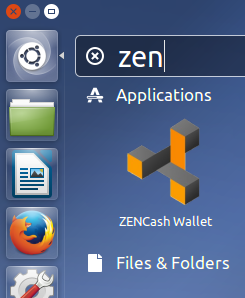

## [Anonymous](https://anonymousbitcoin.io/) Desktop GUI Wallet APT repository for Debian/Ubuntu Linux

This is a [Anonymous](https://anonymousbitcoin.io/) Desktop GUI Wallet made available through a package repository
for Debian/Ubuntu (and similar) Linux systems.

### IMPORTANT: Please read the [security notice](KnownSecurityIssues.md) about watch-only addresses before using the wallet!


### Installing theAnonymousDesktop GUI Wallet on Linux

To setup the APT repository and install packages, using a terminal run the following commands
```
sudo apt-get update
sudo apt-get install apt-transport-https lsb-release

echo 'deb https://zencashofficial.github.io/repo/ '$(lsb_release -cs)' main' | sudo tee --append /etc/apt/sources.list.d/zen.list
gpg --keyserver ha.pool.sks-keyservers.net --recv 219F55740BBF7A1CE368BA45FB7053CE4991B669
gpg --export 219F55740BBF7A1CE368BA45FB7053CE4991B669 | sudo apt-key add -

# TODO this needs to be configured for ANON

sudo apt-get update
sudo apt-get install anonymous-desktop-gui-wallet
```
Then you need to set up the `anon.conf` configuration file:
```
mkdir -p ~/.anon
echo "rpcuser=username" >> ~/.anon/anon.conf
echo "rpcpassword=$(head -c 32 /dev/urandom | base64)" >> ~/.anon/anon.conf
```

Finally you need to download the Z cryptographic keys (takes a while):
```
anon-fetch-params
```

### Running the Anonymous Desktop GUI Wallet on Linux

To launch theAnonymousDesktop GUI Wallet you can just search and click on it in the Ubuntu unity menu:


...or alternatively, run the command `anonymous-desktop-gui-wallet` from a terminal:
```
anonymous-desktop-gui-wallet
```

### Disclaimer

THE SOFTWARE IS PROVIDED "AS IS", WITHOUT WARRANTY OF ANY KIND, EXPRESS OR
IMPLIED, INCLUDING BUT NOT LIMITED TO THE WARRANTIES OF MERCHANTABILITY,
FITNESS FOR A PARTICULAR PURPOSE AND NONINFRINGEMENT. IN NO EVENT SHALL THE
AUTHORS OR COPYRIGHT HOLDERS BE LIABLE FOR ANY CLAIM, DAMAGES OR OTHER
LIABILITY, WHETHER IN AN ACTION OF CONTRACT, TORT OR OTHERWISE, ARISING FROM,
OUT OF OR IN CONNECTION WITH THE SOFTWARE OR THE USE OR OTHER DEALINGS IN THE
SOFTWARE.

### Known issues and limitations
1. Limitation: if two users exchange text messages via the messaging UI TAB and one of them has a system clock, substantially running slow or fast by more than 1 minute, it is possible that this user will see text messages appearing out of order.
1. Limitation: if a messaging identity has been created (happens on first click on the messaging UI tab), then replacing the `wallet.dat` or changing the node configuration between mainnet and testnet will make the identity invalid. This will result in a wallet update error. To remove the error the directory `~/.AnonymousDesktopWallet/messaging` may be manually renamed or deleted (when the wallet is stopped). **CAUTION: all messaging history will be lost in this case!**
1. Limitation: Wallet encryption has been temporarily disabled inAnonymousdue to stability problems. A corresponding issue
[#1552](https://github.com/zcash/zcash/issues/1552) has been opened by the ZCash developers. Correspondingly
wallet encryption has been temporarily disabled in theAnonymousDesktop GUI Wallet.
1. Issue: GUI data tables (transactions/addresses etc.) allow copying of data via double click but also allow editing.
The latter needs to be disabled.
1. Limitation: The list of transactions does not show all outgoing ones (specifically outgoing Z address
transactions). A corresponding issue [#1438](https://github.com/zcash/zcash/issues/1438) has been opened
for the ZCash developers.
1. Limitation: The CPU percentage shown to be taken by anond on Linux is the average for the entire lifetime
of the process. This is not very useful. This will be improved in future versions.
